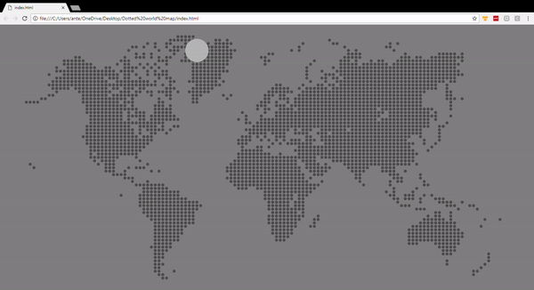

# Dotted World Map

There is a svg stored in js variable -> see file svg.js.
When a index.html is loaded, then svg is applied to a div in a body of page.
After that function animate() from svg-script.js is called where random circle from
svg is chosen and custom style (animation, radius of circle and grey color) is added in pages head.
There is also 'animationend' event which is calling the same function after animation has finished.

